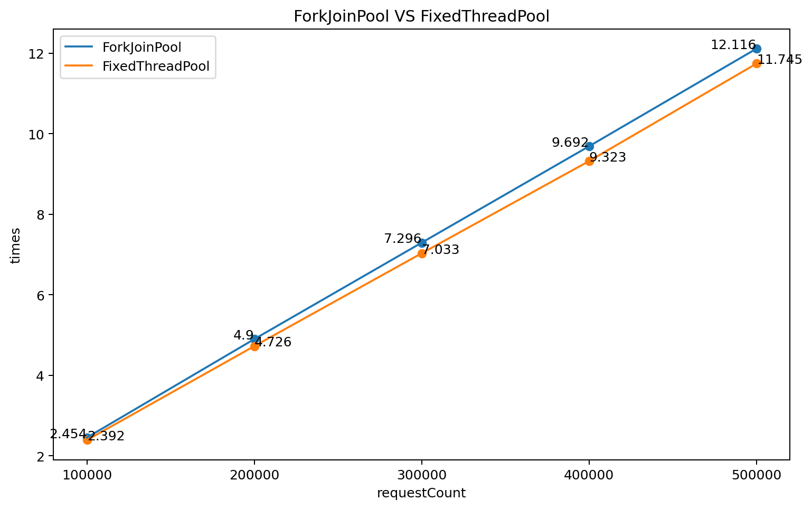

# Kona-Fiber-Task

# JMH测试用例说明

## 测试场景和目标

通过协程将批量的mysql `select`查询操作提交到独立线程池，并让协程异步等待独立线程池执行完毕（通过CompletableFuture实现） 。

根据`Thread.ofVirtual().scheduler()`切换协程的调度器，测试该场景下不同调度器的性能。

## 设计思路

使用协程池代替协程的创建以及完成`select`任务的提交和等待执行完毕

### 类介绍

ConnectionPool：数据库连接池，负责数据库的连接、释放，以及管理`ConnectionNode`

ConnectionNode：数据库连接节点

SyncDatabaseDemoTest：测试类

### SyncDatabaseDemoTest 类介绍

**jmh测试参数**

threadCountInput：控制 threadCount

requestCountInput：控制 requestCount

testOptionInput：控制 `testOption`

**静态类参数**

e（协程池）：用于管理协程、提交数据库查询任务，通过`ExecutorService e = Executors.newFixedThreadPool(threadCount, factory);`创建，threadCount 与 factory 作为变量输入

scheduler（调度器）：通过testOption决定协程的调度器，`testOption=1`采用`ForkJoinPool`，`testOption=2`采用FixedThreadPool，调度器使用相同的并行数，通过`ThreadFactory factory = Thread.ofVirtual().scheduler(scheduler).factory();`设置 schedule

db_executor（线程池）：执行数据库查询任务，通过`db_executor = Executors.newFixedThreadPool(Runtime.getRuntime().availableProcessors() * 2);`创建

threadCount（协程池大小）：决定协程池大小

requestCount（请求量大小）：提交的mysql查询数量

testOption：1 表示 ForkJoinPool 作为调度器，2 表示 FixedThreadPool 作为调度器

**方法**

initExecutor：初始化协程池 e、线程池 db_executor，设置协程调度器 scheduler

execQuery：执行sql语句，拼接字符串返回结果

submitQuery：提交查询语句至独立线程池，返回 `future.get()`

testSyncQuery：完成查询任务的提交和等待执行完毕，关闭资源

## 实现

源码位于项目 data_benchmark_test 

# 测试结果

## threadCount = 1000 

| requestCountInput | testOptionInput | threadCountInput | Score  | Error   | Units |
| ----------------- | --------------- | ---------------- | ------ | ------- | ----- |
| 100000            | 1               | 1000             | 2.415  | ± 0.033 | s/op  |
| 100000            | 2               | 1000             | 2.367  | ± 0.042 | s/op  |
| 200000            | 1               | 1000             | 4.818  | ± 0.066 | s/op  |
| 200000            | 2               | 1000             | 4.668  | ± 0.054 | s/op  |
| 300000            | 1               | 1000             | 7.271  | ± 0.063 | s/op  |
| 300000            | 2               | 1000             | 7.081  | ± 0.094 | s/op  |
| 400000            | 1               | 1000             | 9.572  | ± 0.173 | s/op  |
| 400000            | 2               | 1000             | 9.296  | ± 0.09  | s/op  |
| 500000            | 1               | 1000             | 11.992 | ± 0.155 | s/op  |
| 500000            | 2               | 1000             | 11.665 | ± 0.258 | s/op  |

## threadCount = 2000

| requestCountInput | testOptionInput | threadCountInput | Score  | Error   | Units |
| ----------------- | --------------- | ---------------- | ------ | ------- | ----- |
| 100000            | 1               | 2000             | 2.454  | ± 0.026 | s/op  |
| 100000            | 2               | 2000             | 2.392  | ± 0.048 | s/op  |
| 200000            | 1               | 2000             | 4.9    | ± 0.056 | s/op  |
| 200000            | 2               | 2000             | 4.726  | ± 0.058 | s/op  |
| 300000            | 1               | 2000             | 7.296  | ± 0.059 | s/op  |
| 300000            | 2               | 2000             | 7.033  | ± 0.059 | s/op  |
| 400000            | 1               | 2000             | 9.692  | ± 0.062 | s/op  |
| 400000            | 2               | 2000             | 9.323  | ± 0.213 | s/op  |
| 500000            | 1               | 2000             | 12.116 | ± 0.156 | s/op  |
| 500000            | 2               | 2000             | 11.745 | ± 0.105 | s/op  |

# 结论

在协程处理简单批量数据库`select`查询并异步等待执行完毕的场景下，相同的并行数量（FixedThreadPool使用 parallelism 参数，FixedThreadPool 使用 pool size 参数），调度器FixedThreadPool的性能可能比ForkJoinPool好，因为当前场景是I/O 密集型，每个协程需要计算的时间相同并且非常少，不存在负载失衡的情况，所以FixedThreadPool也能很好的完成任务，而ForkJoinPool存在work stealing调度机制，导致额外判断反而浪费了cpu，ForkJoinPool消耗在awaitWork() 和 scan() 方法时间较多。性能分析详细见下面。

# 火焰图开销分析

删除JMH测试中的注解，编写与测试中功能一致的Demo，便于火焰图生成的准确性，在threadCount = 1000，requestCount = 100000的情况下，分别生成不同调度器下的火焰图，源码和火焰图原文件位于 mysql_virturethread_schedule_compare中。

通过比较，相似的cpu消耗比如 SyncDatabaseDemo.main、java/lang/Continuation.start、start_thread（系统内核）、sun/misc/InnocuousThread.run

不同的cpu消耗位于`java/lang/Thread.run`和`java/util/concurrent/ForkJoinWorkerThread.run`。其中`java/util/concurrent/CompletableFuture.complete`cpu消耗高的原因在于ForkJoinPool创建或激活任务消耗高（即ForkJoinPool中的signalWork方法）。

`java/util/concurrent/ForkJoinWorkerThread.run`的额外时间消耗在于`  ForkJoinPool$WorkQueue.runTask`、`ForkJoinPool.awaitWork`、`ForkJoinPool.scan`方法，原因在于ForkJoinPool存在work stealing的机制。

ForkJoinPool调度器下的开销，文件profiler1.html

| 函数                                                         | 调用栈中cpu占比较大的函数                                    |
| ------------------------------------------------------------ | ------------------------------------------------------------ |
| SyncDatabaseDemo.main（44 samples）                          | ConnectionPool.initConnectionPool（37 samples）              |
| java/lang/Continuation.start（732 samples）                  | java/util/concurrent/CompletableFuture.waitingGet（642 samples） |
| java/lang/Thread.run（2732 samples）                         | SyncDatabaseDemo.execQuery（2501 samples）                   |
|                                                              | java/util/concurrent/CompletableFuture.complete（184 samples） |
|                                                              | java/util/concurrent/ThreadExecutor.getTask（20 samples）    |
| java/util/concurrent/ForkJoinWorkerThread.run（189 samples） | java/util/concurrent/ForkJoinPool$WorkQueue.runTask（57 samples） |
|                                                              | java/util/concurrent/ForkJoinPool.awaitWork（105 samples）   |
|                                                              | java/util/concurrent/ForkJoinPool.scan（26 samples）         |
| start_thread（系统内核）（537 samples）                      |                                                              |
| sun/misc/InnocuousThread.run（293 samples）                  | java/lang/Thread.run                                         |

FixedThreadPool调度器下的开销，文件profiler2.html

| 函数                                        | 调用栈中cpu占比较大的函数                                    |
| ------------------------------------------- | ------------------------------------------------------------ |
| SyncDatabaseDemo.main（42 samples）         | ConnectionPool.initConnectionPool（33 samples）              |
| java/lang/Continuation.start（726 samples） | java/util/concurrent/CompletableFuture.waitingGet（592 samples） |
| java/lang/Thread.run（2816 samples）        | SyncDatabaseDemo.execQuery（2525 samples）                   |
|                                             | java/util/concurrent/CompletableFuture.complete（80 samples） |
|                                             | java/lang/VitualThread.runContinuation（64 samples）         |
|                                             | java/util/concurrent/ThreadExecutor.getTask（91 samples）    |
| start_thread（系统内核）（554 samples）     |                                                              |
| sun/misc/InnocuousThread.run（299 samples） | java/lang/Thread.run                                         |

