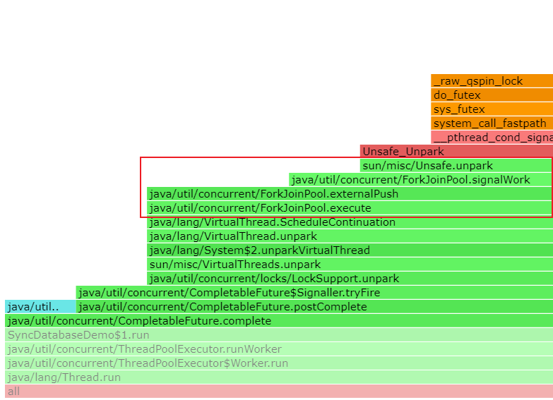
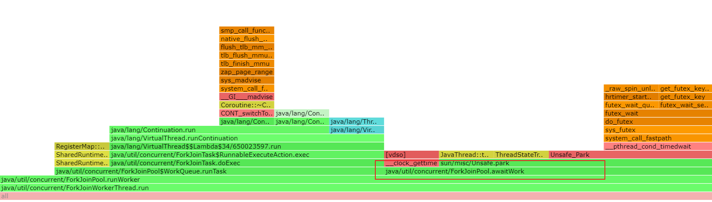
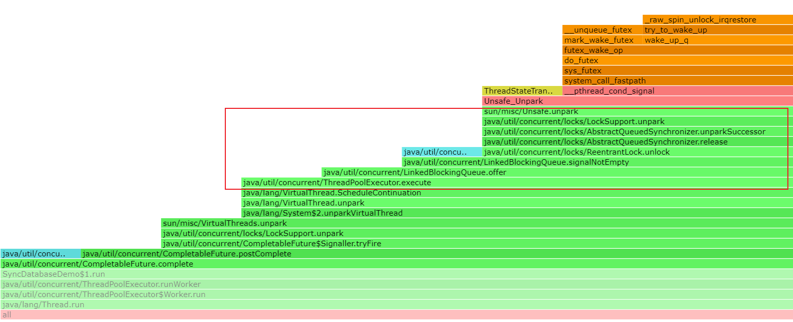
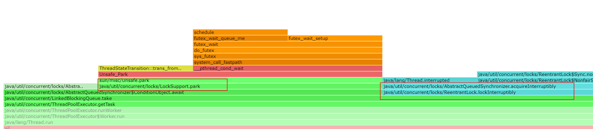

# Kona-Fiber-Task
# jmh测试代码说明

源码在项目 data_benchmark_test 

参考 https://github.com/Tencent/TencentKona-8/tree/KonaFiber/demo/fiber/mysql_sync_stress_demo 的代码，迁移userFiber模式的执行代码，并将协程的调度器改为自定义的`ForkJoinPool`和`FixedThreadPool`调度器，代码添加在`SyncDatabaseDemoTest`类的`initExecutor`方法中，通过`testOption`变量来选择调度器，主要添加代码如下：

```java
    public static void initExecutor() {
        ThreadFactory factory;

        if (testOption == 1) {
            scheduler = new ForkJoinPool(Runtime.getRuntime().availableProcessors());
        }else {
            scheduler = Executors.newFixedThreadPool(Runtime.getRuntime().availableProcessors());
        }

        factory = Thread.ofVirtual().factory();

        e = Executors.newFixedThreadPool(threadCount, factory);

        // an independent thread pool which has 16 threads
        db_executor = Executors.newFixedThreadPool(Runtime.getRuntime().availableProcessors() * 2);
    }
```

# jmh测试结果

## threadCount = 1000 

数据

| requestCountInput | testOptionInput | threadCountInput | Score  | Error   | Units |
| ----------------- | --------------- | ---------------- | ------ | ------- | ----- |
| 100000            | 1               | 1000             | 2.415  | ± 0.033 | s/op  |
| 100000            | 2               | 1000             | 2.367  | ± 0.042 | s/op  |
| 200000            | 1               | 1000             | 4.818  | ± 0.066 | s/op  |
| 200000            | 2               | 1000             | 4.668  | ± 0.054 | s/op  |
| 300000            | 1               | 1000             | 7.271  | ± 0.063 | s/op  |
| 300000            | 2               | 1000             | 7.081  | ± 0.094 | s/op  |
| 400000            | 1               | 1000             | 9.572  | ± 0.173 | s/op  |
| 400000            | 2               | 1000             | 9.296  | ± 0.09  | s/op  |
| 500000            | 1               | 1000             | 11.992 | ± 0.155 | s/op  |
| 500000            | 2               | 1000             | 11.665 | ± 0.258 | s/op  |


## threadCount = 2000

数据

| requestCountInput | testOptionInput | threadCountInput | Score  | Error   | Units |
| ----------------- | --------------- | ---------------- | ------ | ------- | ----- |
| 100000            | 1               | 2000             | 2.454  | ± 0.026 | s/op  |
| 100000            | 2               | 2000             | 2.392  | ± 0.048 | s/op  |
| 200000            | 1               | 2000             | 4.9    | ± 0.056 | s/op  |
| 200000            | 2               | 2000             | 4.726  | ± 0.058 | s/op  |
| 300000            | 1               | 2000             | 7.296  | ± 0.059 | s/op  |
| 300000            | 2               | 2000             | 7.033  | ± 0.059 | s/op  |
| 400000            | 1               | 2000             | 9.692  | ± 0.062 | s/op  |
| 400000            | 2               | 2000             | 9.323  | ± 0.213 | s/op  |
| 500000            | 1               | 2000             | 12.116 | ± 0.156 | s/op  |
| 500000            | 2               | 2000             | 11.745 | ± 0.105 | s/op  |


## 结论

在分别使用1000和2000容量的协程池`FixedThreadPool`条件下，
设置调度器相同的并发数（通过Runtime.getRuntime().availableProcessors()获得值），协程调度器`FixedThreadPool`比`ForkJoinPool`的性能好

# 不同调度器的火焰图对比

火焰图测试代码和结果文件位于项目 mysql_virturethread_schedule_compare

在下面的图中，图一、图二表示ForkJoinPool调度器运行的部分火焰图，图三、图四表示FixedThreadPool运行的部分火焰，

导致调度器性能差异的原因主要在于实现的机制不同，从图一、二可见ForkJoinPool调度器采用Unsafe的park/unpark机制，从图三、四可见而FixedThreadPool调度器采用ReentrantLock锁、LockSupport、AbstractQueuedSybchronizer机制

## 图一



## 图二



## 图三



## 图四



